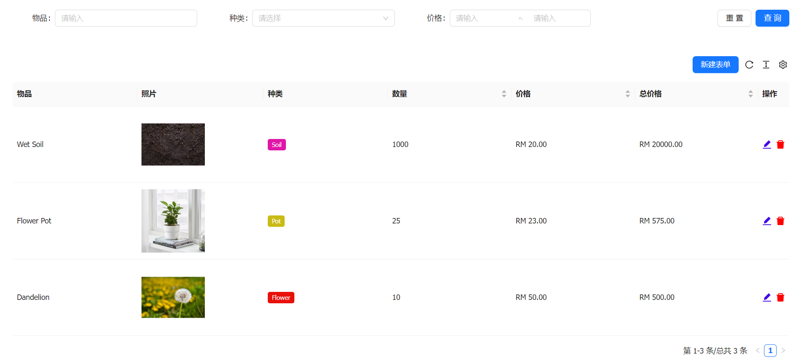
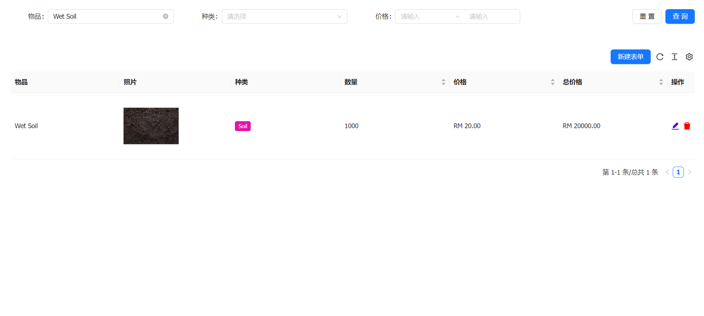
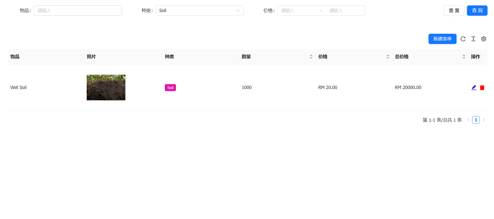
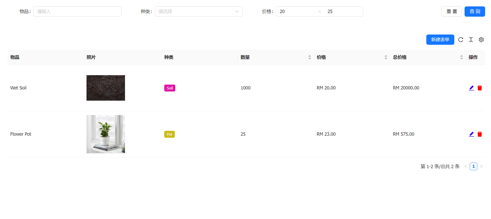
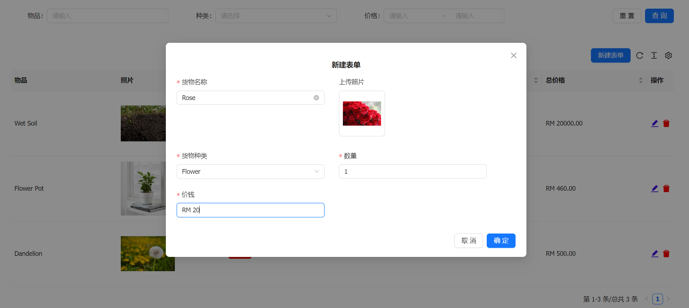
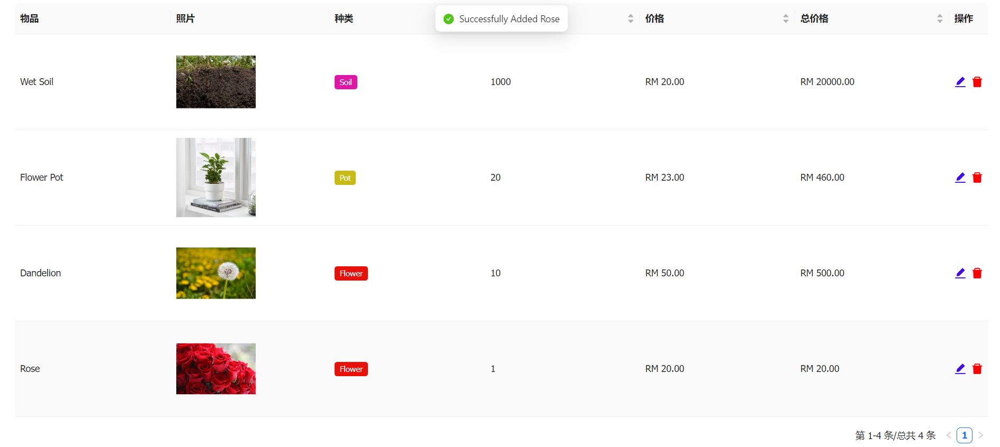
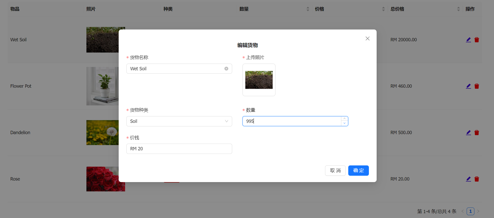
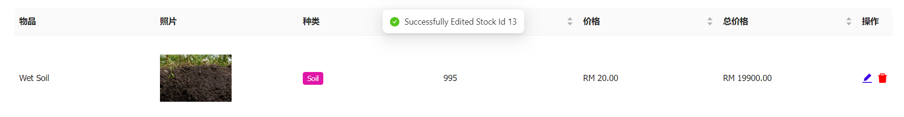
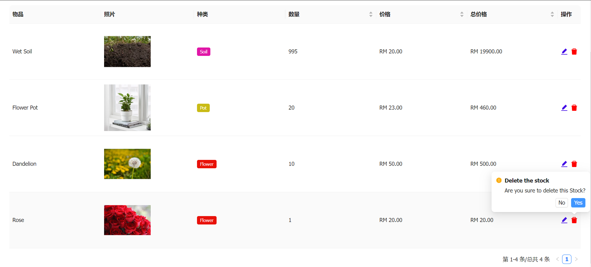
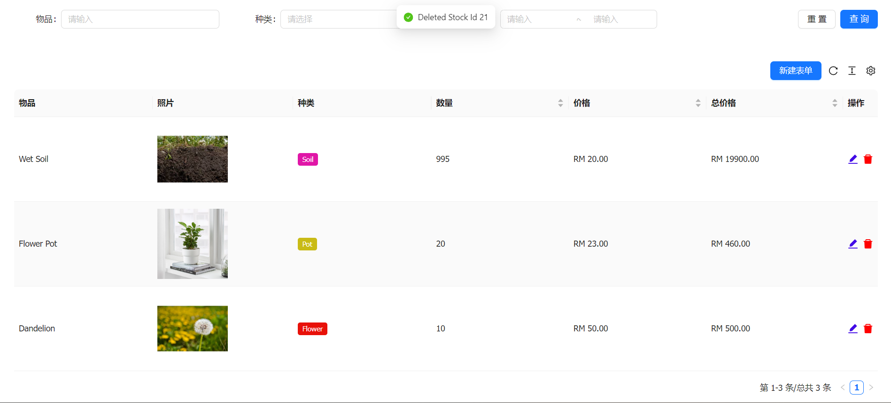

## Stock Management
Welcome to the Stock Management project! This application is built to streamline stock management tasks, providing users with a convenient interface to view, add, edit, and delete stock items efficiently.

## Technologies Used

* __Frontend__: Built with __React.js__ and styled using __Ant Design__, a popular UI framework for React applications. Ant Design provides a sleek and responsive user interface, enhancing the overall user experience.

* __Backend__: Developed with __ASP.NET Core Web API__ as the primary programming language. __Entity Framework Core (EF Core)__ is utilized for database interaction, offering seamless data access and manipulation.

* __Database__: Utilizes __Microsoft SQL Server (MS SQL)__ as the backend database management system. MS SQL provides robust data storage and retrieval capabilities, ensuring the reliability and scalability of the application.
## Demo Screenshots

__Figure 1__: Home Index - Overview of stock items

__Figure 2__: Filter By Name - Searching for specific stock items by name

__Figure 3__: Filter By Category - Filtering stock items by category

__Figure 4__: Filter By Price - Filtering stock items by price range

__Figure 5__: Add Stock Form - Adding a new stock item

__Figure 6__: Add Stock Result - Confirmation of successful stock addition

__Figure 7__: Edit Stock Form - Modifying an existing stock item

__Figure 8__: Edit Result - Confirmation of successful stock item modification

__Figure 9__: Delete Stock - Prompt for confirmation before deleting a stock item

__Figure 10__: Delete Result - Confirmation of successful stock item deletion

## Contributing

Contributions are welcome! If you'd like to contribute to this project, please fork the repository, make your changes, and submit a pull request. For major changes, please open an issue first to discuss the proposed changes.

## License
This project is licensed under the __MIT License__.
